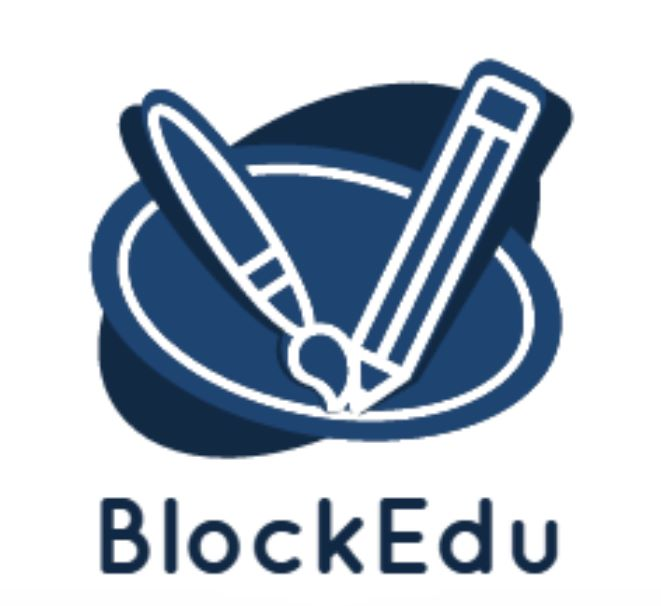

# BlockEdu

  

 

<b>Our Team presents BlockEdu

<blockquote align="center">built on ☕ at <a href="https://ethglobal.com/events/scaling2023">Scaling Ethereum 2023</a>.</blockquote>

# 💡  Introduction

Welcome to our revolutionary project, a university portal that is designed to enhance the educational experience for students while prioritizing privacy, security, and convenience. 

Our portal includes several innovative features, including an announcements tab that uses push protocol notifications to keep students informed about the latest news and updates, and filecoin storage for student assignments that ensures data privacy and security. 

Additionally, we have incorporated the use of Polygon ZK-EVM network for faster transactions in Ethereum chain, and the revolutionary Superfluid platform for students to pay their tuition fees on the go, streamlining the payment process for greater ease and flexibility.
We are dispatching degree certificates in the form of of ERC721 SBT using scroll.

With our team's expertise, passion, and commitment to excellence, we are confident that this project will transform the way students experience education, and set a new standard for university portals across the world.
✨🔥

# 💪 Key Features

- An announcements tab that uses push protocol notifications to keep students informed about the latest news and updates.
- Filecoin storage for student assignments that ensures data privacy and security.
- The use of Polygon ZK-EVM network for faster transactions in Ethereum chain.
- Integration of the Superfluid platform for students to pay their tuition fees on the go, streamlining the payment process for greater ease and flexibility.
- A secure portal for students to upload their assignments without disclosing their identity to the teacher.
- Teacher and Student can communicate with each other using push group chat while maintaining their privacy and security.
- Integration with a range of learning management systems and educational tools to enhance the overall educational experience.
- A personalized dashboard for each student that provides real-time updates on their academic progress, grades, and feedback from teachers.
- A robust analytics system that tracks student performance and identifies areas for improvement.
- We are dispatching degree certificates in the form of of ERC721 SBT using scroll.

# 🧠 Market Opportunities

- Growing Demand for Secure and Private Educational Solutions
- Demand for Faster Transactions
- Growing Market for Learning Management Systems
- Increasing Competition in the Educational Technology Market

# 📺 Preview

  

  

  

  

# 💻 Tech Stack

- Next.js
- Solidity
- Polygon
- Superfluid  
- Push
- Graph
- Scroll

# ⏭️ What's next

- Extending this system to more sophististicated systems. 

# 📜 License

`BlockEdu` is available under the MIT license. See the [`LICENSE`](https://opensource.org/license/mit/) file for more info.

# 🤝 Contributing

Please read [`Contributing.md`](https://contributing.md/) for details on our code of conduct, and the process for submitting pull requests to us.

# 💥 Contributors

